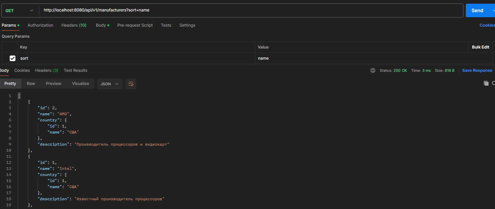
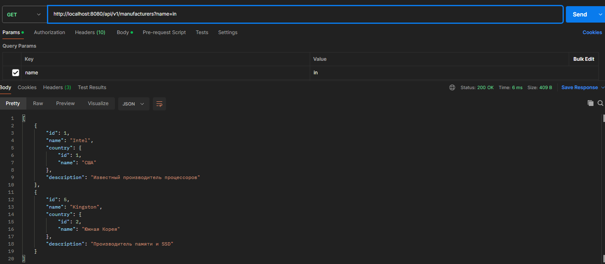
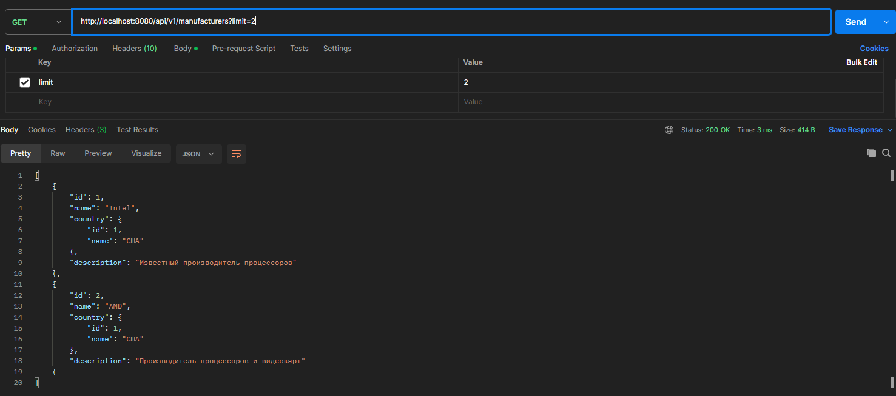
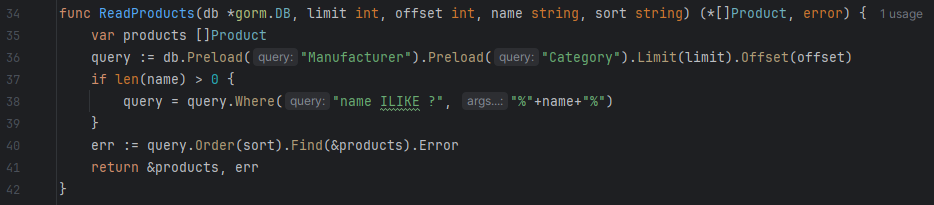
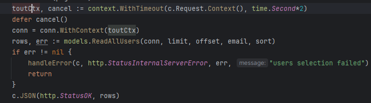

# Панин А.А. ЭФМО-01-24

В данной практике была добавлена фильтрация и пагинация возвращаемых данных. Также был добавлен механизм контроля тайм-аутов при выполнении запросов к БД. Помимо этого были добавлены новые запросы к БД через GORM.

#### Сортировка данных

#### Фильтрация по названию производителя

#### Пагинация данных

#### Реализация фильтрации и пагинации через GORM

#### Реализация механизма тайм-аутов через контекст

