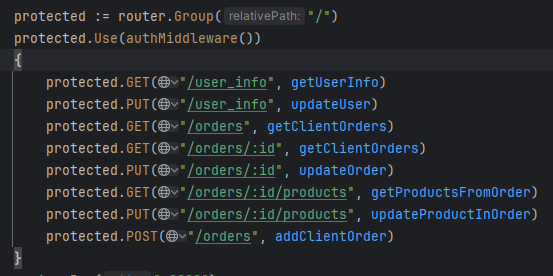
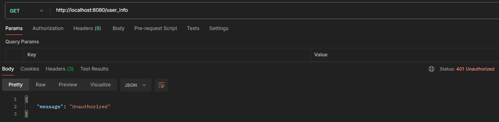
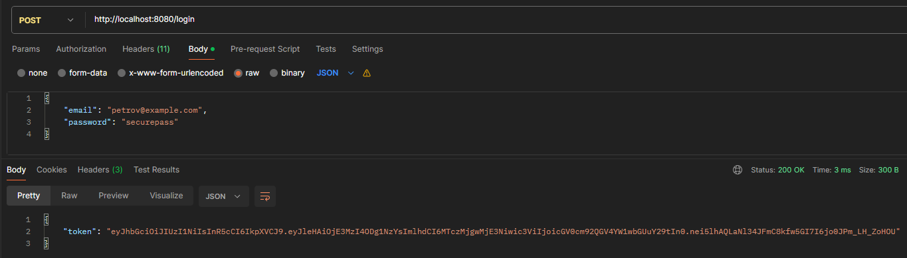
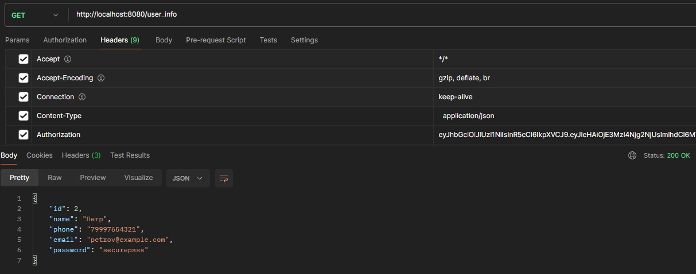
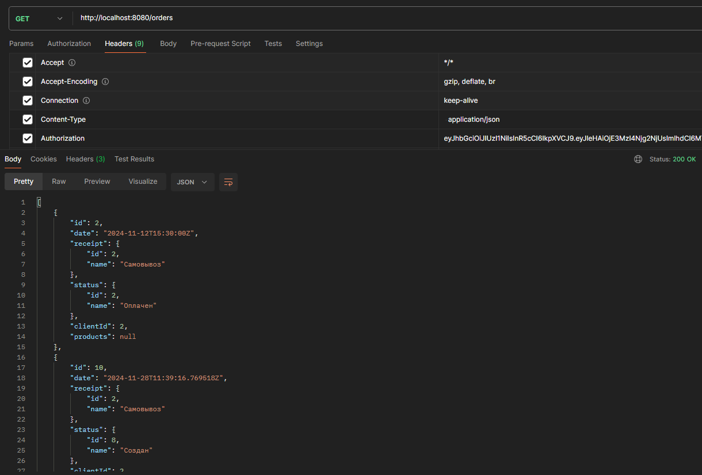

# Панин А.А. ЭФМО-01-24

В данной практике был создан api с поддержкой авторизации и аутентификации.
#### 1. Запросы доступные авторизованному пользователю

#### 2. Результат запроса к защищенному эндпоинту

#### 3. Получение токена для авторизации

#### 4. Запрос данных с использованием полученного токена

#### 5. Просмотр списка заказов

