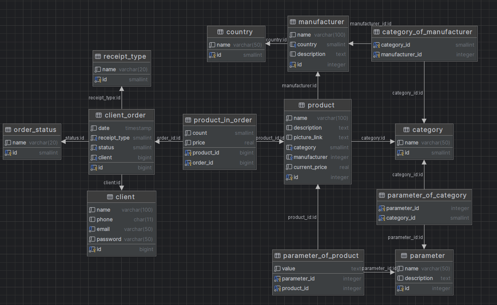
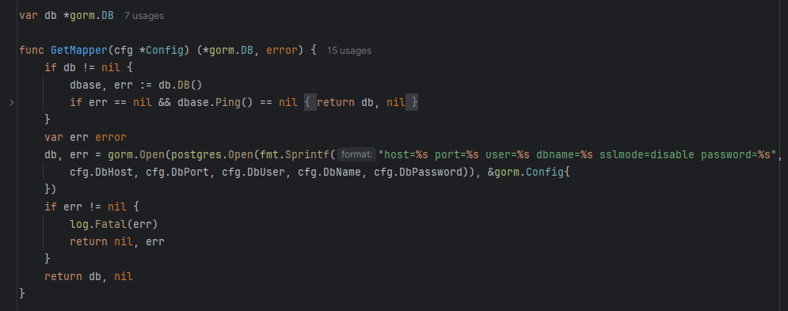
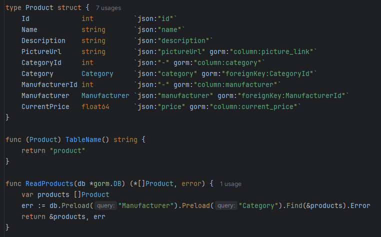
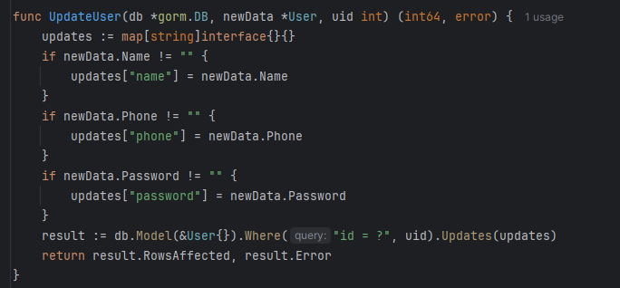
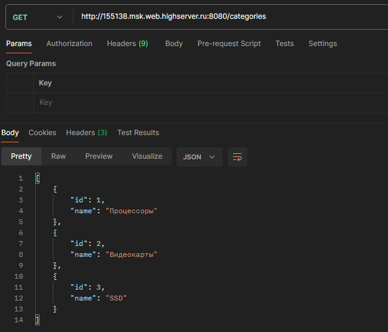

# Панин А.А. ЭФМО-01-24

В данной практике было настроено общение с базой данных с использованием библиотеки GORM. Помимо этого приложение было развернуто на удаленном сервере.

#### Схема базы данных

#### Подключение к базе данных через GORM

#### Класс для выполнения запросов к базе данных

#### Обновление данных с помощью GORM

#### Выполнение запроса к удаленному серверу

